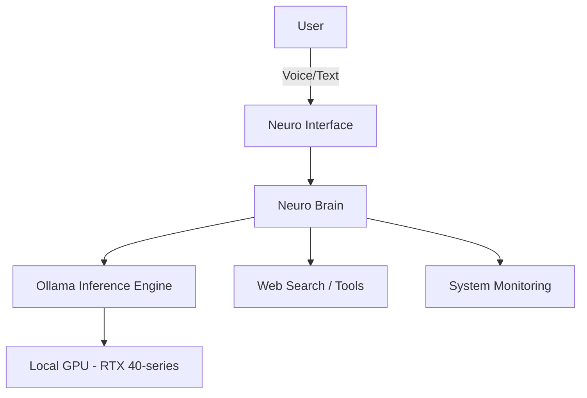

# Neuro

### *Your Privacy-Preserving Digital Twin.*

[](#)
[](https://opensource.org/licenses/MIT)
[](https://www.python.org/downloads/)

---

**Neuro** is a local, autonomous AI entity designed to function as your personal digital twin. By leveraging a fully local inference stack, Neuro provides a high-performance, intelligent companion that respects your privacy and operates entirely within your control.

## ✨ Features

- 🎙️ **Multimodal Interaction**: Seamlessly switch between text-based commands and natural voice conversations.
- 🔒 **Local-First Privacy**: 100% local execution via **Ollama**, ensuring your data and conversations never leave your machine.
- 🧠 **Agentic Memory**: Advanced context management that allows Neuro to maintain persona consistency and understand complex user intents.
- ⚡ **Low-Latency Inference**: Optimized via **4-bit quantization**, specifically tuned for high-speed performance on **NVIDIA RTX 40-series** GPUs.
- 🌐 **Real-time Intelligence**: Integrated web-search capabilities allowing the agent to fetch and synthesize current information.

## 🏗️ Architecture



## 🚀 Installation

### Prerequisites

- **OS**: Linux (Optimized for Linux Mint)
- **Hardware**: NVIDIA GPU (RTX 40-series recommended)
- **Software**: [Ollama](https://ollama.com/)

### Setup Steps

1. **Clone the Repository**
   ```bash
   git clone https://github.com/your-username/neuro.git
   cd neuro
   ```

2. **Create a Virtual Environment**
   ```bash
   python3 -m venv venv
   source venv/bin/activate
   ```

3. **Install Dependencies**
   ```bash
   pip install -r requirements.txt
   ```

4. **Configure Local Inference**
   Ensure **Ollama** is running and pull the optimized model:
   ```bash
   ollama pull gemma4-custom:latest
   ```

## 🛠️ Usage

### Text Mode
For standard terminal-based interaction:
```bash
python main.py
```

### Voice Mode
To enable real-time speech recognition and voice synthesis:
```bash
python main.py --voice
```

## 🗺️ Roadmap

- [ ] **Advanced Tool-Calling**: Expanded integration with local file systems and smart home APIs.
- [ ] **UI Refinements**: A polished, dedicated desktop application.
- [ ] **RAG Implementation**: Retrieval-Augmented Generation for deep knowledge of your personal documents.
- [ ] **Vector Database**: Long-term, semantic memory storage using a local vector DB.

## 🤝 Contributing

Contributions are what make the open-source community such an amazing place to learn, inspire, and create. Any contributions you make are **greatly appreciated**.

1. Fork the Project
2. Create your Feature Branch (`git checkout -b feature/AmazingFeature`)
3. Commit your Changes (`git commit -m 'Add some AmazingFeature'`)
4. Push to the Branch (`git push origin feature/AmazingFeature`)
5. Open a Pull Request

## 📄 License

Distributed under the **MIT License**. See `LICENSE` for more information.

---
*Developed with passion for privacy and intelligence.*
